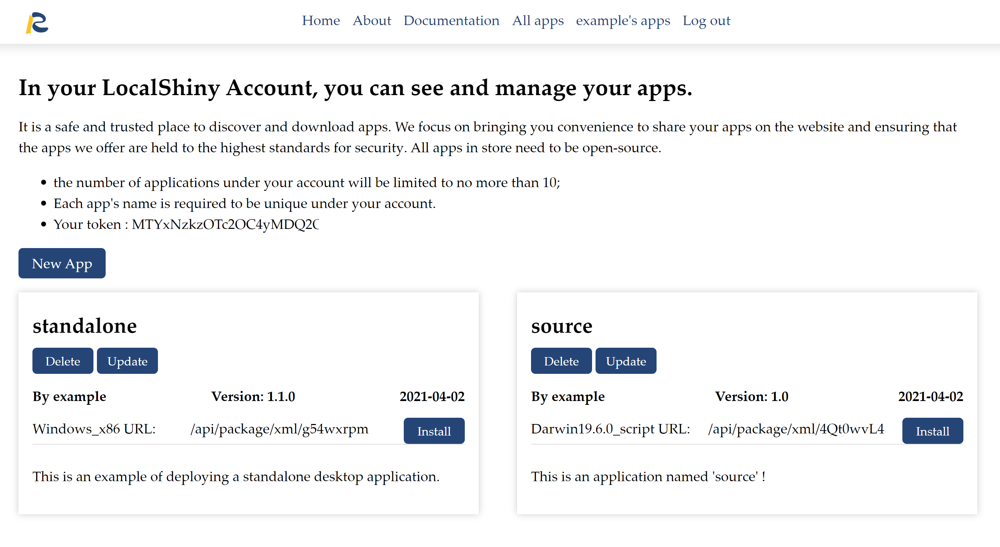

# Deploy Applications

The most suggested method uses the R package LocalShiny to deploy Shiny web apps.

## 3.1 Configure LocalShiny package

After successful installation of the package, configure it to access your account before you deploy applications to the cloud. Once you set up an account in LocalShiny web, the database will automatically generate a contiguous sequence of characters as a token used to authorize your account. The token is listed on your account profile. 

{:width="100%"}

You can copy the token and use _LocalShiny::loginAccount()_ to configure the package.

```r
# copy the token then paste it into the R console. 
LocalShiny::loginAccount(“example”,token=“MTYxNzkzOTc2OC4yMDQ2OTc2LWFhZDk2MjkwMWZkNTBkNDY2YjE4YmI1MjAxZDVjZDkzYjc1OGI0NjktZXhhbXBsZQ==”)
```

## 3.2 Prepare a shiny app that works

### server.R

```r
# Define server logic to summarize and view selected dataset ----
server <- function(input, output) {
    # Return the requested dataset ----
    datasetInput <- reactive({switch(input$dataset,
                                     "rock" = rock, 
                                     "pressure" = pressure, 
                                     "cars" = cars)}
    )
    # Generate a summary of the dataset ----
    output$summary <- renderPrint({dataset <- datasetInput(),
                                   summary(dataset)}
    )
    # Show the first "n" observations ----
    output$view <- renderTable({head(datasetInput(), 
                                 n = input$obs)}
    )
}
```

### ui.R

```r
# Define UI for dataset viewer app ----
ui <- fluidPage(
    # App title ----
    titlePanel("Shiny Text"),
    # Sidebar layout with a input and output definitions ----
    sidebarLayout(
        # Sidebar panel for inputs ----
        sidebarPanel(
            # Input: Selector for choosing dataset ----
            selectInput(inputId = "dataset",
                        label = "Choose a dataset:",
                        choices = c("rock", "pressure", "cars")
        ),
        # Input: Numeric entry for number of obs to view ----
        numericInput(inputId = "obs",
                        label = "Number of observations to view:",
                        value = 10)
        ),
        # Main panel for displaying outputs ----
        mainPanel(
        # Output: Verbatim text for data summary ----
                    verbatimTextOutput("summary"),
                    # Output: HTML table with requested number of observations ----
                    tableOutput("view")
        )
    )
)
```

Test that your application works by running it locally. Set your working directory to your app directory, and then run:

```r
library(shiny)
runApp()
```

If the app works, let’s upload it to the LocalShiny web.

## 3.3 Deploy applications

Once you have configured the LocalShiny R package, you can use the function LocalShiny::deployApp() to upload Shiny apps under your account. In this function, the state of a project's R package dependencies will be captured and stored in a lock file. This lock file will be uploaded together with all the other application files. 

```r
# use deplpyApp() to distribute an app named “source”
#“path_shiny” is set as your app directory.
LocalShiny::deployApp(username="exampl", project="path_shiny", name="source")
```

Congratulations! You’ve deployed your app named "source".
{:width="100%"}