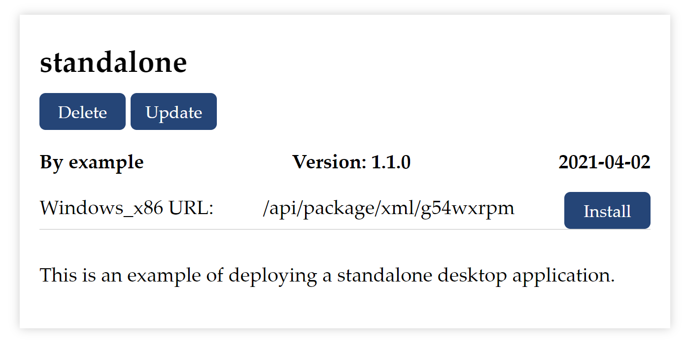

# Delete Applications

You can also mange your app deployed on the website. 

{:width="45%"}

Delete an app by clicking the button delete, or with __LocalShiny::deleteApp()__.

To use it, run:

```r
# make sure that you have configured the package to access your account
# LocalShiny::loginAccount(“example”, token=example_token)
# if you want to delete app “source”
LocalShiny::deleteApp(“source”)
```
