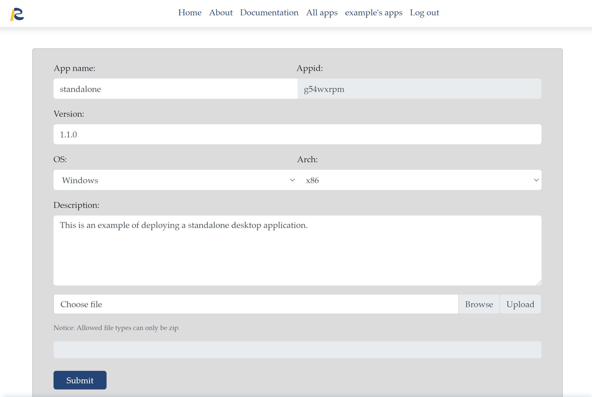

# Update Applications

Your account can upload no more than ten apps. If you make changes to your code or app information, you can update it instead of deploying a new one. Notice that you cannot change your app name. If you have to do that, you need to delete it and deploy a new one.

There are two ways to update your apps. If you want to make changes to the app description and version, we recommend you update apps on the website directly. On the website, click update, then you change app contents listed on the window.

{:width="100%"}

We recommend you to use LocalShiny::deployApp() to update apps if you have made changes to codes. In the function, set the app name as same as that of the application deployed before, you will update it.

```r
#“path_shiny” is set as your app directory.
# update your app, you need to set the name as same as before
LocalShiny::deployApp(username="example", project="path_shiny", name="source")
```

```r
# change the app name , you need to deploy the app with a new name
LocalShiny::deployApp(username="example", project="path_shiny", name="source1")
```