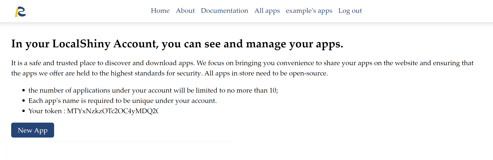
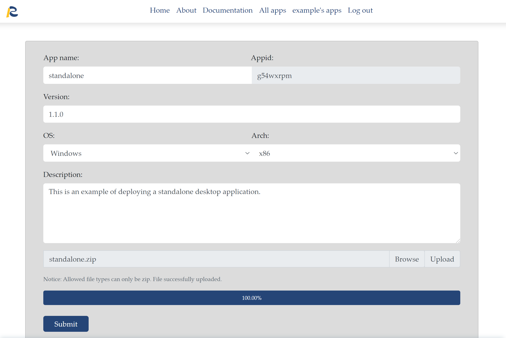
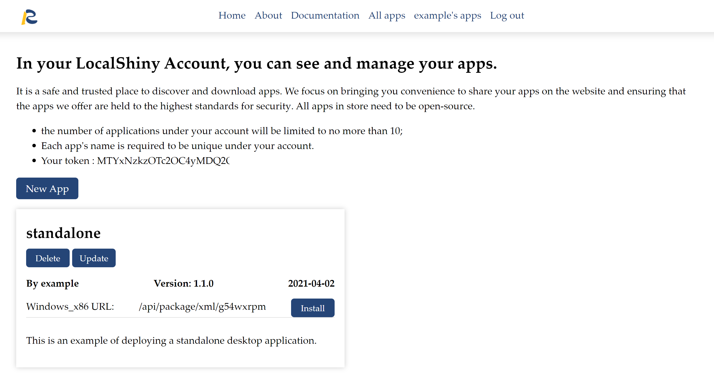

# Deploy standalone Applications

In addition to __LocalShiny__ R package, you can upload a standalone desktop application via the website directly. The users installing it need not have R and any other required packages to install and run the app. It is a portable version of the app.

Bundle the app you wish to distribute as a standalone desktop application, with an installer file. The application files must be in zip format. Then log into the LocalShiny website, go to your account profile, and click the **New App** below.

{:width="100%"}

After that, a window will pop up that shows all required information to deploy an app. Click menu bar choices to access various setting options for application configuration. Select application files you wish to deploy and then click **Submit**.

{:width="100%"}

Now, you have successfully uploaded an app to the website.

{:width="100%"}