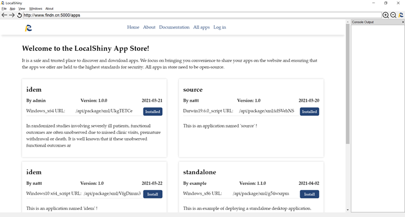
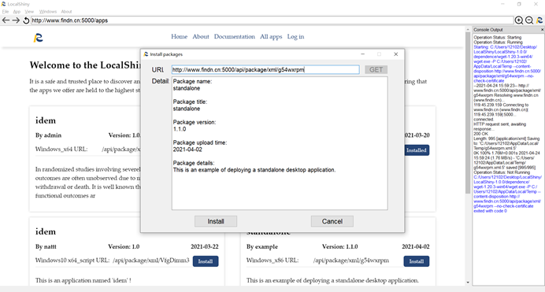

# Install Shiny Applications

LocalShiny software automates the process of installing shiny apps. You can install Shiny apps with only one click. 

If you are installing Shiny web applications on local computer machine, click All apps to go to the app store, where all Shiny apps hosted on our web are listed. 

{:width="100%"}

Select Shiny apps of interest and click **Install** to access more information about the apps you choose. A window will pop up that shows full information about the app. After that, click **Install** or **Cancel** to continue to install apps or abort the installation. 

{:width="100%"}
