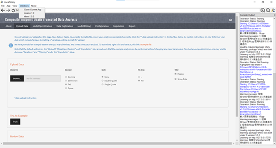

# Stop Shiny Applications

How to stop a running app? Force the app to close when necessary by click the button **Windows**, then click **Close Current App**. The R session in the console would be terminated at the same time. You can also switch apps by click buttons corresponding to different opened apps in **Windows**.

{:width="100%"}