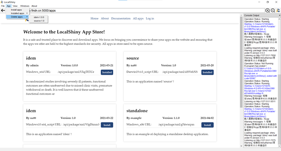
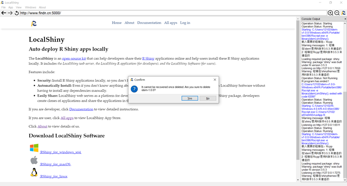

# Delete Shiny Applications

You can also manage installed apps on your local machine. You can delete an app on your computer by clicking the button **App**. Then go to **Delete** apps, scroll down to the app you wish to remove, and click it. A prompt box will pop up to confirm whether you want to delete the app, if you confirm, click **Yes**, otherwise click **No**.

{:width="100%"}

{:width="100%"}